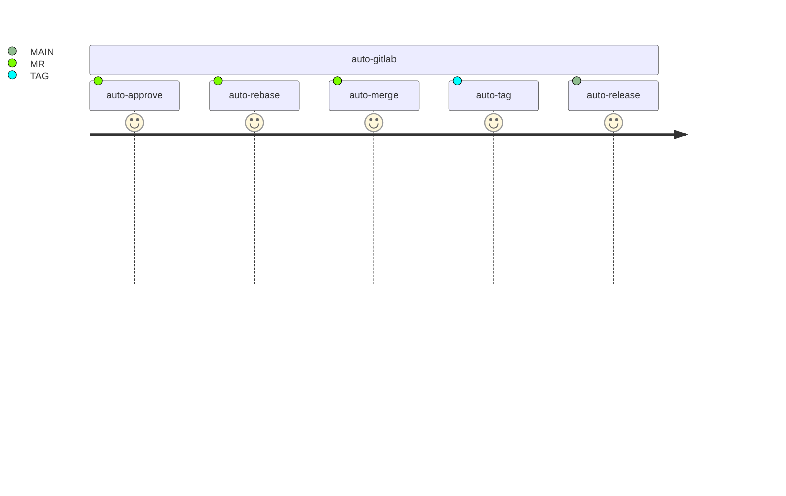

# auto-gitlab

Набор модулей для автоматизации процессов gitlab ci

### Usage

```yaml
include:
  - local: templates/auto-approve/template.yml
  - local: templates/auto-rebase/template.yml
  - local: templates/auto-merge/template.yml
    inputs:
      auto-remove-source-branch: true
  - local: templates/auto-tag/template.yml
    inputs:
      auto-tag: true
      auto-tag-version-major: 0
      auto-tag-version-minor: 4
  - local: templates/auto-release/template.yml

stages:
  - auto-gitlab

.auto-gitlab:auto-release:public:RELEASE-md:
  - |
    cat > RELEASE.md <<EOF
    ### TEST
    EOF

.auto-gitlab:auto-release:public:links-json:
  - |
    jq -n \
      --arg tag "$TAG" \
      --arg api "${CI_API_V4_URL}" \
      --arg project_id "${CI_PROJECT_ID}" \
      --arg project_url "${CI_PROJECT_URL}" \
      '[
        {
          name: ("file-" + $tag + ".txt"),
          direct_asset_path: "/file.txt",
          link_type: "other",
          url: ($api + "/projects/" + $project_id + "/packages/generic/example/" + $tag + "/file.txt")
        },
        {
          name: "file-latest.txt",
          direct_asset_path: "/file-latest.txt",
          link_type: "other",
          url: ($project_url + "/-/releases/permalink/latest/downloads/file.txt")
        }
      ]' > assets-links.json
```


### pipline



### Общие свойства

- stage: `auto-gitlab`
- Название job формируются с префиксом `$[[ inputs.job-prefix | expand_vars ]]`
- Установка зависимости от стороннего job:
  ```yaml
  .auto-gitlab:auto-core:public:needs:
    - job: some-job
  ```
- Права на все действия с повышенными правами берутся из jwt-токена CI-variable `$AUTO_GITLAB_TOKEN`
  - approve
  - rebase
  - MR
  - tag

### auto-approve (= нарушение регламента =)

- Автоматическое одобрение MR при помощи токена
- Условия
  ```yaml
  "auto-gitlab:auto-approve:core$[[ inputs.job-prefix | expand_vars ]]":
    rules:
      - !reference [ .utils:toolkit:shared:tagged, not ]
      - !reference [ .utils:toolkit:shared:source, only_merge ]
      - if: '"$[[ inputs.auto-approve ]]" == "true"'
        when: never
      - !reference [ .auto-gitlab:auto-approve:public:rules-extends ]

  .auto-gitlab:auto-approve:public:rules-extends:
    - when: on_success
  ```

### auto-rebase

- Переброс коммитов текущей ветки в конец ветки приёмника.  
- Может быть обязательным требованием для MR.
- Условия
  ```yaml
  "auto-gitlab:auto-rebase:core$[[ inputs.job-prefix | expand_vars ]]":
    rules:
      - !reference [ .utils:toolkit:shared:tagged, not ]
      - !reference [ .utils:toolkit:shared:source, only_merge ]
      - if: '"$[[ inputs.auto-rebase ]]" == "true"'
        when: never
      - !reference [ .auto-gitlab:auto-rebase:public:rules-extends ]
  .auto-gitlab:auto-rebase:public:rules-extends:
    - when: on_success
  ```

### auto-merge (= нарушение регламента =)

- Применение MR
- inputs
```yaml
  inputs:
    auto-remove-source-branch:
      description: "Auto remove source branch after merge"
      type: boolean
      default: false
```
- Условия
  ```yaml
  "auto-gitlab:auto-merge:core$[[ inputs.job-prefix | expand_vars ]]":
    rules:
      - !reference [ .utils:toolkit:shared:tagged, not ]
      - !reference [ .utils:toolkit:shared:source, only_merge ]
      - if: '"$[[ inputs.auto-merge ]]" != "true"'
        when: never
      - !reference [ .auto-gitlab:auto-merge:public:rules-extends ]
  .auto-gitlab:auto-merge:public:rules-extends:
    - when: on_success
  ```

### auto-tag (= нарушение регламента =)

- Каждый commit в main cоздает tag с увеличенным на 1 номером patch
- inputs
```yaml
  inputs:
    auto-tag-version-prefix:
      description: "Prefix for autogenerated tag"
      type: string
      default: ""
    auto-tag-version-major:
      type: string
      default: "0"
    auto-tag-version-minor:
      type: string
      default: "0" 
```
- Условия
```yaml
"auto-gitlab:auto-create-TAG:core$[[ inputs.job-prefix | expand_vars ]]":
  rules:
    - !reference [ .utils:toolkit:shared:tagged, not ]
    - if: '"$[[ inputs.auto-tag ]]" != "true"'
      when: never
    - !reference [ .auto-gitlab:auto-tag:public:rules-extends ]
.auto-gitlab:auto-tag:public:rules-extends:
  - !reference [ .utils:toolkit:shared:default-branch, only ]
  - when: on_success
```

### auto-release

- Создаёт релиз при создании tag.
- Добавление текста релиза:
```yaml
.auto-gitlab:auto-release:public:RELEASE-md:
  - echo "## TEST" > RELEASE.md
```
Добавление ссылок на файлы:
```yaml
.auto-gitlab:auto-release:public:links-json:
  - |
    jq -n \
      --arg tag "$TAG" \
      --arg api "${CI_API_V4_URL}" \
      --arg project_id "${CI_PROJECT_ID}" \
      --arg project_url "${CI_PROJECT_URL}" \
      '[
        {
          name: ("file-" + $tag + ".txt"),
          direct_asset_path: "/file.txt",
          link_type: "other",
          url: ($api + "/projects/" + $project_id + "/packages/generic/example/" + $tag + "/file.txt")
        },
        {
          name: "file-latest.txt",
          direct_asset_path: "/file-latest.txt",
          link_type: "other",
          url: ($project_url + "/-/releases/permalink/latest/downloads/file.txt")
        }
      ]' > assets-links.json
```
- Условия
```yaml
"auto-gitlab:auto-release:core$[[ inputs.job-prefix | expand_vars ]]":
  rules:
    - !reference [ .utils:toolkit:shared:tagged, only ]
    - if: '"$[[ inputs.auto-release ]]" != "true"'
      when: never
    - !reference [ .auto-gitlab:auto-release:public:rules-extends ]
.auto-gitlab:auto-release:public:rules-extends:
  - when: on_success
```
